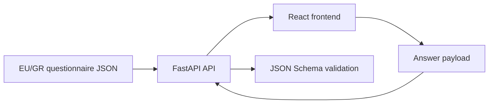

# HEALIE SD-DOH Assessment

A schema-driven **Social and Digital Determinants of Health (SD-DOH)** assessment developed as part of the HEALIE research project. The participant-facing title is **Social and Digital Factors Affecting Health**.

The current redesign uses:

- React and TypeScript for the frontend
- FastAPI for the backend API
- JSON Schema for response validation
- An EU/Greek-adapted questionnaire definition with separately documented legal-needs and digital-access modules

> Research software under active development. It is not currently intended for clinical use.

## Current functionality

The React/FastAPI implementation currently supports:

- Loading the questionnaire definition from FastAPI
- Rendering questions dynamically from the EU/GR v2 JSON configuration
- Section-by-section navigation with progress feedback
- Shared answer state across all sections
- Conditional visibility using `any` and `all` rules
- Equality and multi-select containment conditions
- Automatic removal of answers when conditional questions become hidden
- Required-question checks before moving to the next section
- Explicit optional-question metadata and exclusive decline choices
- Submission of answers to FastAPI
- Server-side validation using JSON Schema
- Derived PHQ-2, HITS, GAD-2, physical-activity, and legal-access indicators
- Participant-facing success and validation-error messages
- Frontend behavioural regression tests with Vitest and React Testing Library

Supported question types:

- Single-select
- Multi-select
- Text
- Boolean
- Integer
- Currency
- Checklist
- Matrix

## Architecture



The backend serves the questionnaire definition and validates submitted responses. The frontend controls rendering, navigation, conditional visibility, and temporary in-memory answer state.

## EU/Greek SD-DOH adaptation

The active questionnaire is:

```text
sdoh_screener_eu_gr_v2.json
```

Its corresponding response schema is:

```text
sdoh_screener_response_schema_eu_gr_v2.json
```

Important adaptations include:

- Required age group for age-specific activity interpretation
- Optional gender, ethnic-group, ancestry, and postal-code responses
- European-region questions
- Euro-based household income brackets
- Education and employment options adapted for European contexts
- Public and private healthcare-coverage categories
- EU-relevant transportation options
- PHQ-2 and GAD-2 screening matrices
- HITS intimate-partner-violence screening when a current partner is reported
- Optional MMSE total field
- An I-HELP-informed legal-needs module
- A six-item Digital Access and Inclusion module

Religion/spiritual-belief items from the earlier adaptation were removed because they were not part of the intended source questionnaire and lacked a documented inclusion rationale. eHEALS is deliberately deferred to a separate HEALIE digital-literacy component.

The complete item-level decisions, rationale, sources, and paper-ready methods language are in [`SD_DOH_QUESTION_AUDIT.md`](SD_DOH_QUESTION_AUDIT.md).

The ontology mapping is stored in:

```text
sdoh_ontology_mapping_eu_gr_v2.json
```

## Requirements

The redesign has been developed and tested with:

- Python 3.13
- Node.js 24
- npm
- FastAPI
- React 19
- TypeScript
- Vite

Other recent Python and Node.js versions may also work, but these are the versions currently used during development.

## Local setup

Clone the repository and enter its directory:

```bash
git clone https://github.com/ckakalou/SDoH_Screener.git
cd SDoH_Screener
git switch redesign/react-fastapi
```

### Windows PowerShell

Create and activate a Python virtual environment:

```powershell
python -m venv SDoHScreener.venv
.\SDoHScreener.venv\Scripts\Activate.ps1
```

Install the backend development dependencies:

```powershell
python -m pip install -r backend/requirements-dev.txt
```

Install the frontend dependencies:

```powershell
npm.cmd --prefix frontend ci
```

### macOS or Linux

Create and activate a Python virtual environment:

```bash
python3 -m venv .venv
source .venv/bin/activate
```

Install the backend development dependencies:

```bash
python -m pip install -r backend/requirements-dev.txt
```

Install the frontend dependencies:

```bash
npm --prefix frontend ci
```

## Run the application

The backend and frontend run in separate terminals.

### 1. Start FastAPI

From the repository root:

```bash
python -m uvicorn backend.app.main:app --reload --port 8001
```

Available backend URLs:

- Health check: <http://127.0.0.1:8001/health>
- Questionnaire API: <http://127.0.0.1:8001/api/v1/screener>
- Swagger documentation: <http://127.0.0.1:8001/docs>
- ReDoc documentation: <http://127.0.0.1:8001/redoc>

### 2. Start React

On Windows:

```powershell
npm.cmd --prefix frontend run dev
```

On macOS or Linux:

```bash
npm --prefix frontend run dev
```

Open:

<http://localhost:5173>

During development, Vite proxies requests beginning with `/api` to the FastAPI backend on port `8001`.

## API endpoints

### `GET /health`

Checks whether the backend is running.

Example response:

```json
{
  "status": "ok"
}
```

### `GET /api/v1/screener`

Returns the EU/GR SD-DOH questionnaire definition used by the React frontend.

### `POST /api/v1/screener/validate`

Validates submitted answers against the EU/GR response schema, visible-question requirements, and exclusive-answer rules.

Example request:

```json
{
  "responses": {
    "dem_age_group": "22_30",
    "q3_household_income": "20000_29999",
    "q11_internet": true,
    "q20a_pa_days": "3",
    "q20b_pa_minutes": 60,
    "ddoh_device_access": "always"
  }
}
```

Successful response:

```json
{
  "valid": true,
  "message": "The screener responses are valid.",
  "derived": {
    "weekly_minutes_activity": 180,
    "physical_activity_need": false
  }
}
```

Invalid values produce an HTTP `422` response containing the first validation error.

## Testing and quality checks

Run the backend tests:

```bash
python -m pytest backend/tests -v
```

On Windows, run the frontend checks with:

```powershell
npm.cmd --prefix frontend run lint
npm.cmd --prefix frontend run build
npm.cmd --prefix frontend test
```

On macOS or Linux:

```bash
npm --prefix frontend run lint
npm --prefix frontend run build
npm --prefix frontend test
```

Check staged or unstaged changes for whitespace errors:

```bash
git diff --check
```

A message stating that LF will be replaced by CRLF is an expected Git line-ending warning on Windows.

## Project structure

```text
SDoH_Screener/
├── backend/
│   ├── app/
│   │   ├── main.py
│   │   └── models.py
│   ├── tests/
│   │   └── test_api.py
│   ├── requirements.txt
│   └── requirements-dev.txt
├── frontend/
│   ├── public/
│   │   └── healie_final_official_logo_trans_crop.png
│   ├── src/
│   │   ├── api/
│   │   │   └── screenerApi.ts
│   │   ├── components/
│   │   │   ├── QuestionCard.tsx
│   │   │   └── UiIcon.tsx
│   │   ├── types/
│   │   │   └── screener.ts
│   │   ├── utils/
│   │   │   └── visibility.ts
│   │   ├── test/
│   │   │   └── setupTests.ts
│   │   ├── App.test.tsx
│   │   ├── App.tsx
│   │   └── App.css
│   ├── package.json
│   ├── vite.config.ts
│   └── vitest.config.ts
├── sdoh_screener_eu_gr_v2.json
├── sdoh_screener_response_schema_eu_gr_v2.json
├── sdoh_ontology_mapping_eu_gr_v2.json
├── SD_DOH_QUESTION_AUDIT.md
├── emit_rdf_eu_gr_v2.py
├── app.py
└── app_eu_gr_v2.py
```

## Legacy Streamlit prototypes

The repository retains the original Streamlit applications for reference:

- `app.py`: original questionnaire prototype
- `app_eu_gr_v2.py`: EU/GR-adapted Streamlit prototype
- `README_eu_gr_v2.md`: documentation for the EU/GR Streamlit version

The React/FastAPI implementation is the active redesign.

## Current limitations

The current redesign:

- Stores answers only in React memory
- Resets answers after a full browser refresh
- Does not persist responses in a database
- Does not include authentication or participant consent
- Requires every visible question except those explicitly marked optional
- Returns selected derived screening indicators but does not provide diagnosis or clinical decision support
- Still includes a development-only answer-state inspector
- Requires cognitive interviewing, translation/back-translation, accessibility review, and psychometric validation
- Uses project-authored legal and digital modules that must not be described as validated scales

## Safety and privacy

Production deployment will require:

- An appropriate consent process
- GDPR-compliant data handling
- Secure storage and transport
- Access control and authentication
- A defined retention and deletion policy
- A locally approved safety protocol for sensitive screening areas, including intimate-partner violence
- Clear clinical-governance boundaries explaining that screening results are not a diagnosis
